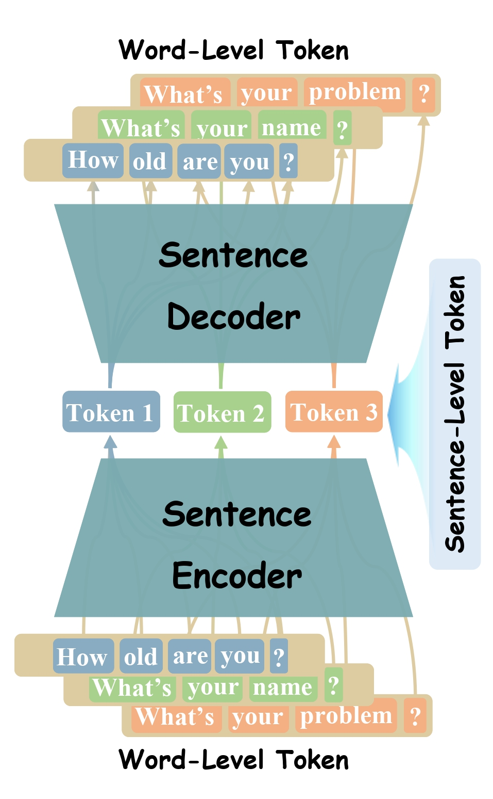
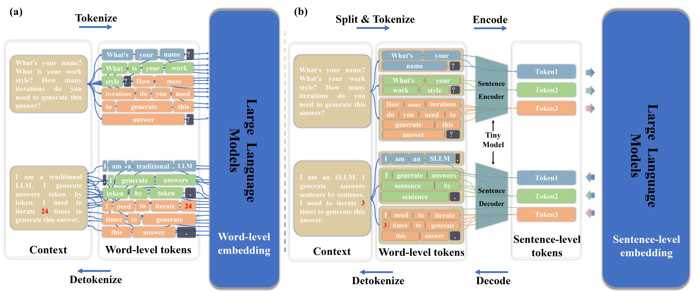
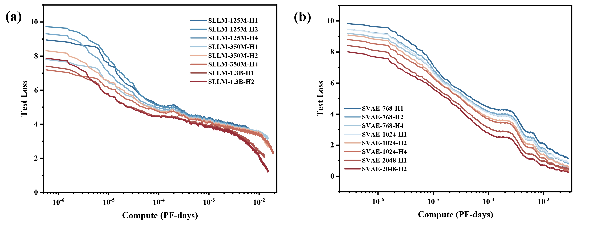

  

  

English | [简体中文](README_zh-CN.md)

# 1.Introduction

Current large language models (LLMs) primarily utilize next-token prediction method for inference, which significantly impedes their processing speed. In this [paper](https://arxiv.org/abs/2408.00655), we introduce a novel inference methodology termed next-sentence prediction, aiming at enhancing the inference efficiency of LLMs. We present Sentence Variational Autoencoder (SentenceVAE), which includes a Sentence Encoder to compress multiple tokens in a sentence into a single token, and a Sentence Decoder to reconstruct it. 

     
    <small>Fig. 1. The schematic form of SentenceVAE. </small>

By integrating SentenceVAE into the input and output layers of LLMs, we develop Sentence-level LLMs (SLLMs) that employ a sentence-by-sentence inference method.

    
    <small>Fig. 2. (a) The schematic form of published LLMs. (b) The schematic form of SLLMs, which embedded with SentenceVAEs.</small>

The SLLMs can maintain the integrity of the original semantic content by segmenting the context into sentences, thereby improving accuracy while boosting inference speed. Moreover, compared to previous LLMs, SLLMs process fewer tokens over equivalent context length, significantly reducing memory demands for self-attention computation and facilitating the handling of longer context. Extensive experiments on [Wanjuan dataset](https://github.com/opendatalab/WanJuan1.0/) have revealed that the proposed method can accelerate inference speed by 204~365%, reduce perplexity (PPL) to 46~75% of its original metric, and decrease memory overhead by 86~91% for the equivalent context length, compared to previous token-by-token methods.

<table border="1" cellspacing="0" cellpadding="5">
  <tr>
    <th rowspan="2">Model</th>
    <th rowspan="2">Total Params</th>
    <th colspan="3">Average PPL</th>
    <th colspan="3">Mean output throughput (toks/s)</th>
    <th colspan="3">Mean GPU memory (KB/token)</th>
  </tr>
  <tr>
    <th>OPT↓</th>
    <th>SLLM↓</th>
    <th>Δ↓</th>
    <th>OPT↑</th>
    <th>SLLM↑</th>
    <th>Δ↑</th>
    <th>OPT↓</th>
    <th>SLLM↓</th>
    <th>Δ↓</th>
  </tr>
  <tr>
    <td>SLLM-125M-H1</td>
    <td>214M</td>
    <td rowspan="3">26.75</td>
    <td>31.68</td>
    <td>+18.4%</td>
    <td rowspan="3">214.57</td>
    <td><b>652.78</b></td>
    <td><b>+204.2%</b></td>
    <td rowspan="3">73.15</td>
    <td>12.03</td>
    <td>-83.6%</td>
  </tr>
  <tr>
    <td>SLLM-125M-H2</td>
    <td>226M</td>
    <td>44.60</td>
    <td>+66.7%</td>
    <td>539.80</td>
    <td>+151.6%</td>
    <td><b>7.08</b></td>
    <td><b>-90.3%</b></td>
  </tr>
  <tr>
    <td>SLLM-125M-H4</td>
    <td>250M</td>
    <td><b>14.32</b></td>
    <td><b>-46.5%</b></td>
    <td>332.12</td>
    <td>+54.8%</td>
    <td>10.00</td>
    <td>-86.3%</td>
  </tr>
  <tr>
    <td>SLLM-350M-H1</td>
    <td>429M</td>
    <td rowspan="3">25.18</td>
    <td>24.84</td>
    <td>-1.4%</td>
    <td rowspan="3">144.33</td>
    <td><b>481.39</b></td>
    <td><b>+233.5%</b></td>
    <td rowspan="3">197.59</td>
    <td>29.98</td>
    <td>-84.8%</td>
  </tr>
  <tr>
    <td>SLLM-350M-H2</td>
    <td>450M</td>
    <td>14.81</td>
    <td>-41.2%</td>
    <td>442.23</td>
    <td>+206.4%</td>
    <td>26.78</td>
    <td>-86.4%</td>
  </tr>
  <tr>
    <td>SLLM-350M-H4</td>
    <td>492M</td>
    <td><b>10.17</b></td>
    <td><b>-59.6%</b></td>
    <td>315.61</td>
    <td>+118.7%</td>
    <td><b>17.73</b></td>
    <td><b>-91.0%</b></td>
  </tr>
  <tr>
    <td>SLLM-1.3B-H1</td>
    <td>1.61B</td>
    <td rowspan="2">15.95</td>
    <td>8.76</td>
    <td>-45.1%</td>
    <td rowspan="2">119.07</td>
    <td>479.71</td>
    <td>+302.9%</td>
    <td rowspan="2">400.01</td>
    <td>57.07</td>
    <td>-85.7%</td>
  </tr>
  <tr>
    <td>SLLM-1.3B-H2</td>
    <td>1.69B</td>
    <td><b>3.84</b></td>
    <td><b>-75.9%</b></td>
    <td><b>553.95</b></td>
    <td><b>+365.2%</b></td>
    <td><b>55.14</b></td>
    <td><b>-86.2%</b></td>
  </tr>
</table>

In addition, by corroborating the Scaling Law, we extrapolated the feasibility of our methodologies to larger-scale models.

    
    <small>Fig. 3. Scaling Law of (a) SLLMs and (b) SVAEs.</small>

