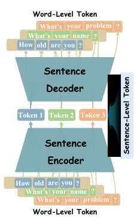

<div align="center">
  

  [](https://arxiv.org/abs/2408.00655)

Hongjun An<sup>1,2*</sup>,Yifan Chen<sup>1,2*</sup>,Zhe Sun<sup>1,2✉</sup> & Xuelong Li<sup>1,2✉</sup>

<sup><a href="https://iopen.nwpu.edu.cn/">1</a></sup>School of Artificial Intelligence, OPtics and ElectroNics(iOPEN), Northwestern PolyTechnical University

<sup>2</sup>Institute of Artificial Intelligence (TeleAI), China Telecom


English | [简体中文](README_zh-CN.md)

</div>

# 1.Introduction

Current large language models (LLMs) primarily utilize next-token prediction method for inference, which significantly impedes their processing speed. In this [paper](https://arxiv.org/abs/2408.00655), we introduce a novel inference methodology termed next-sentence prediction, aiming at enhancing the inference efficiency of LLMs. We present Sentence Variational Autoencoder (SentenceVAE), which includes a Sentence Encoder to compress multiple tokens in a sentence into a single token, and a Sentence Decoder to reconstruct it. 

<div align="center">
    <br>
    <span><small>Fig. 1. The schematic form of SentenceVAE. </small></span>
</div>


By integrating SentenceVAE into the input and output layers of LLMs, we develop Sentence-level LLMs (SLLMs) that employ a sentence-by-sentence inference method.

<div align="center">
    <br>
    <span><small>Fig. 2. (a) The schematic form of published LLMs. (b) The schematic form of SLLMs, which embedded with SentenceVAEs.</small></span>
</div>

The SLLMs can maintain the integrity of the original semantic content by segmenting the context into sentences, thereby improving accuracy while boosting inference speed. Moreover, compared to previous LLMs, SLLMs process fewer tokens over equivalent context length, significantly reducing memory demands for self-attention computation and facilitating the handling of longer context. Extensive experiments on [Wanjuan dataset](https://github.com/opendatalab/WanJuan1.0/) have revealed that the proposed method can accelerate inference speed by 204 ~ 365%, reduce perplexity (PPL) to 46 ~ 75% of its original metric, and decrease memory overhead by 86 ~ 91% for the equivalent context length, compared to previous token-by-token methods.

<div align="center">
<table cellspacing="0" cellpadding="5">
  <tr>
    <th rowspan="2">Model</th>
    <th rowspan="2">Total Params</th>
    <th colspan="3">Average PPL</th>
    <th colspan="3">Mean output throughput (toks/s)</th>
    <th colspan="3">Mean GPU memory (KB/token)</th>
  </tr>
  <tr>
    <th>OPT↓</th>
    <th>SLLM↓</th>
    <th>Δ↓</th>
    <th>OPT↑</th>
    <th>SLLM↑</th>
    <th>Δ↑</th>
    <th>OPT↓</th>
    <th>SLLM↓</th>
    <th>Δ↓</th>
  </tr>
  <tr>
    <td>SLLM-125M-H1</td>
    <td>214M</td>
    <td rowspan="3">26.75</td>
    <td>31.68</td>
    <td>+18.4%</td>
    <td rowspan="3">214.57</td>
    <td><b>652.78</b></td>
    <td><b>+204.2%</b></td>
    <td rowspan="3">73.15</td>
    <td>12.03</td>
    <td>-83.6%</td>
  </tr>
  <tr>
    <td>SLLM-125M-H2</td>
    <td>226M</td>
    <td>44.60</td>
    <td>+66.7%</td>
    <td>539.80</td>
    <td>+151.6%</td>
    <td><b>7.08</b></td>
    <td><b>-90.3%</b></td>
  </tr>
  <tr>
    <td>SLLM-125M-H4</td>
    <td>250M</td>
    <td><b>14.32</b></td>
    <td><b>-46.5%</b></td>
    <td>332.12</td>
    <td>+54.8%</td>
    <td>10.00</td>
    <td>-86.3%</td>
  </tr>
  <tr>
    <td>SLLM-350M-H1</td>
    <td>429M</td>
    <td rowspan="3">25.18</td>
    <td>24.84</td>
    <td>-1.4%</td>
    <td rowspan="3">144.33</td>
    <td><b>481.39</b></td>
    <td><b>+233.5%</b></td>
    <td rowspan="3">197.59</td>
    <td>29.98</td>
    <td>-84.8%</td>
  </tr>
  <tr>
    <td>SLLM-350M-H2</td>
    <td>450M</td>
    <td>14.81</td>
    <td>-41.2%</td>
    <td>442.23</td>
    <td>+206.4%</td>
    <td>26.78</td>
    <td>-86.4%</td>
  </tr>
  <tr>
    <td>SLLM-350M-H4</td>
    <td>492M</td>
    <td><b>10.17</b></td>
    <td><b>-59.6%</b></td>
    <td>315.61</td>
    <td>+118.7%</td>
    <td><b>17.73</b></td>
    <td><b>-91.0%</b></td>
  </tr>
  <tr>
    <td>SLLM-1.3B-H1</td>
    <td>1.61B</td>
    <td rowspan="2">15.95</td>
    <td>8.76</td>
    <td>-45.1%</td>
    <td rowspan="2">119.07</td>
    <td>479.71</td>
    <td>+302.9%</td>
    <td rowspan="2">400.01</td>
    <td>57.07</td>
    <td>-85.7%</td>
  </tr>
  <tr>
    <td>SLLM-1.3B-H2</td>
    <td>1.69B</td>
    <td><b>3.84</b></td>
    <td><b>-75.9%</b></td>
    <td><b>553.95</b></td>
    <td><b>+365.2%</b></td>
    <td><b>55.14</b></td>
    <td><b>-86.2%</b></td>
  </tr>
</table>
</div>

In addition, by corroborating the Scaling Law, we extrapolated the feasibility of our methodologies to larger-scale models.

<div align="center">
    <br>
    <span><small>Fig. 3. Scaling Law of (a) SLLMs and (b) SVAEs.</small></span>
</div>

# 2.Quick Start

<details>
<summary>Installation</summary>

Step1. Install SentenceVAE from source.

```sh
git clone https://github.com/BestAnHongjun/SentenceVAE.git
cd SentenceVAE
pip3 install -e . # or python3 setup.py develop
```

</details>

<details>
<summary>Prepare OPT models</summary>

Step1. Create a folder named `model_repo` under `SentenceVAE` to save OPT series models.

```sh
cd SentenceVAE
mkdir -p model_repo
```

Step2. Navigate to the `model_repo` directory with `cd` and initialize [`git-lfs`](https://git-lfs.com).

```sh
cd model_repo
git lfs install
```

Step3. Download [OPT-125M](https://huggingface.co/facebook/opt-125m) model for SentenceVAE-768 series and SLLM-125M series.

```sh
git clone https://huggingface.co/facebook/opt-125m
```

Step4. Download [OPT-350M](https://huggingface.co/facebook/opt-350m) model for SentenceVAE-1024 series and SLLM-350M series.

```sh
git clone https://huggingface.co/facebook/opt-350m
```

Step5. Download [OPT-1.3B](https://huggingface.co/facebook/opt-1.3b) model for Sentence-2048 series and SLLM-1.3B series.

```sh
git clone https://huggingface.co/facebook/opt-1.3b
```

</details>

<details>
<summary>SentenceVAE Demo</summary>

Step1. Download a pretrained model from table below.

<div align="center">

|Model|Hidden Size|Hidden Layers|Loss↓|PPL↓|Download Link|
|:-:|:-:|:-:|:-:|:-:|:-:|
|SVAE-768-H1|768|1|1.339|3.605|[ModelScope](https://modelscope.cn/models/CoderAN/SentenceVAE/resolve/master/SVAE-768-H1.pth)<br>[OpenXLab](https://download.openxlab.org.cn/repos/file/Coder-AN/SentenceVAE/main?filepath=SVAE-768-H1.pth&sign=d8239cd4b6979b61ee0b969ef54f1a78&nonce=1723800234481)|
|SVAE-768-H2|768|2|1.019|2.588|[ModelScope](https://modelscope.cn/models/CoderAN/SentenceVAE/resolve/master/SVAE-768-H2.pth)<br>[OpenXLab](https://download.openxlab.org.cn/repos/file/Coder-AN/SentenceVAE/main?filepath=SVAE-768-H2.pth&sign=c11ca77f7934d4b441e7a6ae5359157f&nonce=1723800264673)|
|SVAE-768-H4|768|4|**0.5598**|**1.649**|[ModelScope](https://modelscope.cn/models/CoderAN/SentenceVAE/resolve/master/SVAE-768-H4.pth)<br>[OpenXLab](https://download.openxlab.org.cn/repos/file/Coder-AN/SentenceVAE/main?filepath=SVAE-768-H4.pth&sign=829995892eba42caf3f28a0f77a28d9e&nonce=1723800281621)|
|SVAE-1024-H1|1024|1|0.9266|2.406|[ModelScope](https://modelscope.cn/models/CoderAN/SentenceVAE/resolve/master/SVAE-1024-H1.pth)<br>[OpenXLab](https://download.openxlab.org.cn/repos/file/Coder-AN/SentenceVAE/main?filepath=SVAE-1024-H1.pth&sign=b3d5202c64d117389131def1b35e2f33&nonce=1723800301123)|
|SVAE-1024-H2|1024|2|0.6610|1.845|[ModelScope](https://modelscope.cn/models/CoderAN/SentenceVAE/resolve/master/SVAE-1024-H2.pth)<br>[OpenXLab](https://download.openxlab.org.cn/repos/file/Coder-AN/SentenceVAE/main?filepath=SVAE-1024-H2.pth&sign=f4ba19e8f474068598f8186be14a7ab4&nonce=1723800319623)|
|SVAE-1024-H4|1024|4|**0.3704**|**1.384**|[ModelScope](https://modelscope.cn/models/CoderAN/SentenceVAE/resolve/master/SVAE-1024-H4.pth)<br>[OpenXLab](https://download.openxlab.org.cn/repos/file/Coder-AN/SentenceVAE/main?filepath=SVAE-1024-H4.pth&sign=6ff668d782383e4bf01d1337a98910b3&nonce=1723800343431)|
|SVAE-2048-H1|2048|1|0.5165|1.622|[ModelScope](https://modelscope.cn/models/CoderAN/SentenceVAE/resolve/master/SVAE-2048-H1.pth)<br>[OpenXLab](https://download.openxlab.org.cn/repos/file/Coder-AN/SentenceVAE/main?filepath=SVAE-2048-H1.pth&sign=4d1ef8d0d0cf0f48e406eb73d74bb5cf&nonce=1723800363566)|
|SVAE-2048-H2|2048|2|0.2845|1.292|[ModelScope](https://modelscope.cn/models/CoderAN/SentenceVAE/resolve/master/SVAE-2048-H2.pth)<br>[OpenXLab](https://download.openxlab.org.cn/repos/file/Coder-AN/SentenceVAE/main?filepath=SVAE-2048-H2.pth&sign=7cc09034413bcfdb0fcbd875e6ad4be4&nonce=1723800379541)|
|SVAE-2048-H4|2048|4|**0.1270**|**1.115**|[ModelScope](https://modelscope.cn/models/CoderAN/SentenceVAE/resolve/master/SVAE-2048-H4.pth)<br>[OpenXLab](https://download.openxlab.org.cn/repos/file/Coder-AN/SentenceVAE/main?filepath=SVAE-2048-H4.pth&sign=8d09686dbcd6aaf0aeaf70a537de1836&nonce=1723800393625)|

</div>

Step2. Run demo script under `tools/demo` folder. Here's an example:

```sh
cd SentenceVAE

python3 tools/demo/demo_svae.py \
    -c config/SVAE/SVAE-768/svae_768_h4.yaml \
    --checkpoint /path/to/pretrained/checkpoint \
    --input "What's your name?"
```

**Arguments**:
* `-c`,`--config`: path to the corresponding configuration file, please reference [this folder](config/SVAE/).
* `--checkpoint`: path to the checkpoint file you just downloaded.
* `--input`: A sentence you want to test.
  * It must be a separate sentence ending with punctuation marks such as commas, periods, etc. Please refer to the [paper](https://arxiv.org/abs/2408.00655) for specific reasons.
  * Currently, only English is supported.

The model will compress this sentence into a single vector, decode and restore it for output. In an ideal state, the output and input should be consistent.

</details>

<details>

<summary>SentenceLLM Demo</summary>

**Notice**: Please be aware that, as SFT datasets are typically commercial secrets and difficult for us to access, all the models listed below are **pre-trained models**, not general-purpose conversation models. Therefore, the **PPL** (Perplexity) metric should be used to assess model quality, not conversational performance. If you treat them as Q&A models, you're likely to get gibberish outputs (***in fact, even our baseline OPT model will output gibberish***). We recommend fine-tuning these models on private SFT datasets to explore their potential as general-purpose conversation models.

Step1. Download a pretrained model from table below.

<div align="center">

|Model|Download Link|
|:-:|:-:|
|SLLM-125M-H1|[ModelScope](https://modelscope.cn/models/CoderAN/SentenceLLM/resolve/master/SLLM-125M-H1.pth)<br>[OpenXLab](https://download.openxlab.org.cn/repos/file/Coder-AN/SentenceLLM/main?filepath=SLLM-125M-H1.pth&sign=b170645b08b03ee1240b95267c7454ca&nonce=1723800424069)|
|SLLM-125M-H2|[ModelScope](https://modelscope.cn/models/CoderAN/SentenceLLM/resolve/master/SLLM-125M-H2.pth)<br>[OpenXLab](https://download.openxlab.org.cn/repos/file/Coder-AN/SentenceLLM/main?filepath=SLLM-125M-H2.pth&sign=fb3e59ef4c30dcea0d732af741d183b2&nonce=1723800472802)|
|SLLM-125M-H4|[ModelScope](https://modelscope.cn/models/CoderAN/SentenceLLM/resolve/master/SLLM-125M-H4.pth)<br>[OpenXLab](https://download.openxlab.org.cn/repos/file/Coder-AN/SentenceLLM/main?filepath=SLLM-125M-H4.pth&sign=d8d1c1aa1d516e26fe21cb1ca3220e62&nonce=1723800484902)|
|SLLM-350M-H1|[ModelScope](https://modelscope.cn/models/CoderAN/SentenceLLM/resolve/master/SLLM-350M-H1.pth)<br>[OpenXLab](https://download.openxlab.org.cn/repos/file/Coder-AN/SentenceLLM/main?filepath=SLLM-350M-H1.pth&sign=bc5e5e777a1bc41a1a564a7e52a2bf94&nonce=1723800502532)|
|SLLM-350M-H2|[ModelScope](https://modelscope.cn/models/CoderAN/SentenceLLM/resolve/master/SLLM-350M-H2.pth)<br>[OpenXLab](https://download.openxlab.org.cn/repos/file/Coder-AN/SentenceLLM/main?filepath=SLLM-350M-H2.pth&sign=6c8ba81b806649366df99c96fbe3e4ed&nonce=1723800517836)|
|SLLM-350M-H4|[ModelScope](https://modelscope.cn/models/CoderAN/SentenceLLM/resolve/master/SLLM-350M-H4.pth)<br>[OpenXLab](https://download.openxlab.org.cn/repos/file/Coder-AN/SentenceLLM/main?filepath=SLLM-350M-H4.pth&sign=e5722a48a5ff516e61cf9efdc1ee8230&nonce=1723800534148)|
|SLLM-1.3B-H1|[ModelScope](https://modelscope.cn/models/CoderAN/SentenceLLM/resolve/master/SLLM-1.3B-H1.pth)<br>[OpenXLab](https://download.openxlab.org.cn/repos/file/Coder-AN/SentenceLLM/main?filepath=SLLM-1.3B-H1.pth&sign=77edd326c8e46eebd98f7f545f4d4e0c&nonce=1723800549084)|
|SLLM-1.3B-H2|[ModelScope](https://modelscope.cn/models/CoderAN/SentenceLLM/resolve/master/SLLM-1.3B-H2.pth)<br>[OpenXLab](https://download.openxlab.org.cn/repos/file/Coder-AN/SentenceLLM/main?filepath=SLLM-1.3B-H2.pth&sign=54dc841b8a067afe7a2fbd16a6c0a2e5&nonce=1723800565365)|

</div>

Step2. Run demo script under `tools/demo` folder. Here's an example:

```sh
cd SentenceVAE

python3 tools/demo/demo_sllm.py \
    -c config/SLLM/SLLM-125m/sllm_125m_h4_all.yaml \
    --checkpoint /path/to/pretrained/checkpoint \
    --input "What's your name?"
```

**Arguments**:
* `-c`,`--config`: path to the corresponding configuration file, please reference [this folder](config/SLLM/).
* `--checkpoint`: path to the checkpoint file you just downloaded.
* `--input`: Your input sentence.


</details>

# 3.Tutorials

Under writing...

<details>
<summary>Train Models</summary>

* [Prepare Datasets](#)
* [Train SentenceVAEs](#)
* [Train SentenceLLMs](#)

</details>

<details>
<summary>Eval Models</summary>

* [Eval OPT models (baseline)](#)
* [Eval SentenceVAEs](#)
* [Eval SentenceLLMs](#)

</details>

<details>
<summary>Test Benchmarks</summary>

* [Test benchmarks of SentenceVAEs](#)
* [Test benchmarks of SentenceLLMs](#)

</details>

# 4.Cite SentenceVAE

If you use SentenceVAE in your research, please cite our work by using the following BibTeX entry:

```bibtex
@article{an2024sentencevae,
  title={SentenceVAE: Enable Next-sentence Prediction for Large Language Models with Faster Speed, Higher Accuracy and Longer Context},
  author={An, Hongjun and Chen, Yifan and Sun, Zhe and Li, Xuelong},
  journal={arXiv preprint arXiv:2408.00655},
  year={2024}
}
```